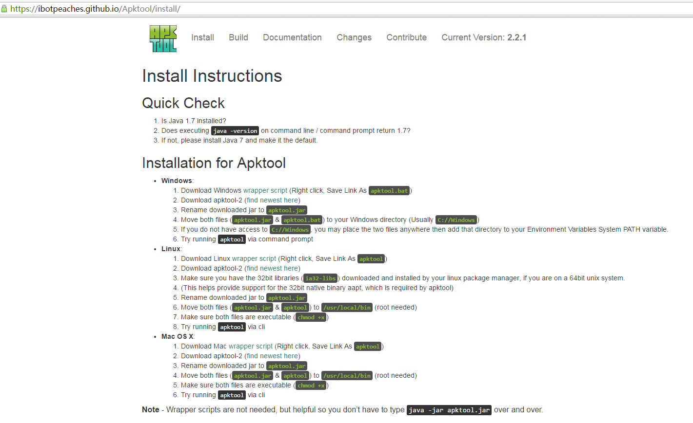
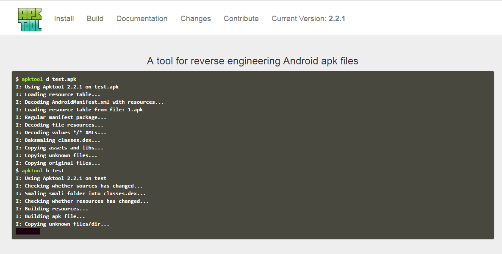

# ToolsResource
存储一些轻量级工具，方便日后的开发使用。

# GIFToos.rar

一款Windows环境下轻量级的gif录制工具，录制gif图比较方便。github上面的gif效果图，一般都是用它制作的。使用真实手机开发的时候，我一般先录制视频，然后用这个工具在播放视频的基础上，录制下gif图。本来希望能够直接将视频转换成Gif，找了些教程发现都比较复杂，操作也不方便。如果有知道简便方法的童鞋，希望不吝赐教，感激不尽！！

# apktools_windows.rar

1、Windows环境下使用apktool，官网教程地址：<https://ibotpeaches.github.io/Apktool/install/>，apktool版本列表官网地址：<https://bitbucket.org/iBotPeaches/apktool/downloads>

工具包里面已经下载了一份Windows下的工具包，版本：2.2.1，发布时间：2016-10-18。

（1）将工具包下载下来，重命名为apktool.jar。

（2）将apktool.jar和apktool.bat拷贝到C盘的Windows文件夹下面即可。

（3）然后在dos下输入apktool试试，看看是否配置成功了。

2、A tool for reverse engineering Android apk files.

